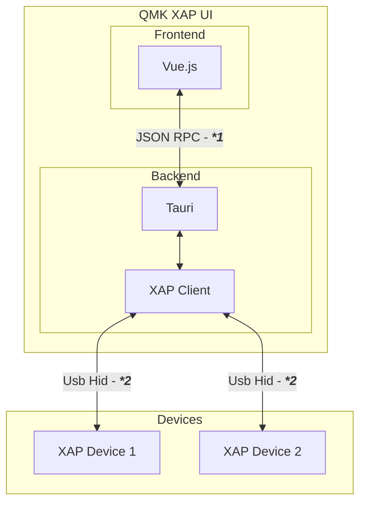

# QMK XAP Client

This repository contains the (experimental) [QMK XAP](https://github.com/qmk/qmk_firmware/pull/13733) protocol client. It is build using the following base technologies:

-   [Tauri](https://tauri.app/) as it's runtime
-   [Vue.js](https://vuejs.org/) as the frontend framework
-   [Quasar](https://quasar.dev/) as the ui component library
-   [Rust](https://www.rust-lang.org/) for the backend
-   [Typescript](https://www.typescriptlang.org/) for the frontend

## Design docs

Deeper coverage of each subsystem lives in `docs/design/`:

-   [`architecture.md`](docs/design/architecture.md) - package layout, runtime topology, ground rules.
-   [`keycode-pipeline.md`](docs/design/keycode-pipeline.md) - catalog versioning, decoder, encoder, display engine, the parameterized picker flow.
-   [`type-bridge.md`](docs/design/type-bridge.md) - how Rust types reach the frontend via specta + tauri-specta, plus the asset staging quirk you will hit.
-   [`device-and-keymap.md`](docs/design/device-and-keymap.md) - `XapClient` / `XapDevice` lifecycle, secure-status flow, `MappedKeymap` data shape.

Start with `architecture.md` if you are new to the repo.

## Syncing QMK Keycodes

The keycode picker uses `xap-specs/assets/keycodes_<version>.generated.hjson`, flattened standalone files generated from QMK's versioned keycode HJSON files. Each generated file contains one fully resolved keycode version and does not depend on older generated files. The app uses the latest bundled version unless backend code requests a specific older version. Regenerate them with:

```sh
yarn sync:keycodes --qmk-firmware /path/to/qmk_firmware
```

If `--qmk-firmware` is omitted, the script reads `QMK_FIRMWARE`. The Python environment running the script must have QMK's Python requirements installed, because the sync delegates version merging and `!delete!`/`!reset!` handling to QMK's own loader.

## Architecture/Design



**(1) JSON RPC:**

frontend and backend communicate over remote procedure calls using JSON as it's data exchange format. These calls come in two flavors:

-   [Commands](https://tauri.app/v1/guides/features/command/): are synchronous and follow a request and response model. Only the frontend can initiate these commands and the backend responds with the help of pre-defined Command handlers. The XAP client makes heavy use of these commands to provide well defined endpoints that either query data from the attached XAP devices or run actions on these devices.
-   [Events](https://tauri.app/v1/guides/features/events/): are asynchronous and do not provide any feedback from the event listeners. Both the frontend and backend can listen to and emit events. The XAP clients backend signals state changes e.g. Newly attached devices or Removed devices to the frontend with these.

All serialization from Rust structs into JSON objects is done automatically with [Serde](https://serde.rs/) + [serde_json](https://github.com/serde-rs/json). To keep the backend structs and the frontend TS types in sync, we use [specta](https://docs.rs/specta) and [tauri-specta](https://docs.rs/tauri-specta) - Rust types decorated with `#[derive(Type)]` and commands with `#[specta::specta]` are emitted into `src/generated/xap.ts` automatically when the app runs in dev mode. The full flow (when the file is regenerated, when hand-edits are safe, the shipped-asset staging quirk) is covered in [`docs/design/type-bridge.md`](docs/design/type-bridge.md).

**(2) USB HID:**

The backend uses [hidapi-rs](https://github.com/ruabmbua/hidapi-rs) to talk to attached XAP devices over USB raw HID. Multiple simultaneously connected devices are supported and disambiguated by a UUID assigned at open time.

Two structs carry the device side:

-   `XapDevice` represents exactly one physically attached device - owns the HID handle, an outstanding-request map, and a broadcast queue.
-   `XapClient` enumerates new devices and forwards requests by UUID.

A single background thread (`App::start_event_loop` in `src-tauri/src/main.rs`) drives both - it calls `enumerate_xap_devices` once per second and `poll_devices` every 100 ms, emitting `XapEvent` payloads to the frontend.

Raw HID packets are parsed into Rust structs via [binrw](https://binrw.rs/). The full device lifecycle, broadcast routing, and the `Keymap` / `MappedKeymap` distinction are covered in [`docs/design/device-and-keymap.md`](docs/design/device-and-keymap.md).

## Project Structure

```
.
├── src                            # Vue 3 frontend
│  ├── pages                       # KeymapView, DeviceInfoView, RGBView
│  ├── components                  # BasicKeyboardLayout (ANSI render)
│  ├── utils                       # Pinia store, event bus, command wrappers
│  └── generated/xap.ts            # specta-generated TS types + command stubs
├── src-tauri                      # Tauri / Rust binary
│  └── src
│     ├── main.rs                  # builder, event loop, command registration
│     ├── xap/                     # XapClient, XapDevice, wire spec (codegen)
│     ├── aggregation/             # Normalised structs for the frontend
│     └── rpc/                     # Tauri commands + XapEvent variants
├── xap-specs                      # Shared domain library + assets
│  ├── assets                      # Versioned keycode hjson + display config
│  │                               # + lighting JSON (shipped as Tauri resources)
│  └── src
│     ├── constants                # Catalog, decoder, encoder, display engine
│     └── {request,response,broadcast,token}.rs   # XAP wire types
├── qmk_firmware_ref/              # QMK submodule (read-only)
└── docs/design/                   # Subsystem-level design docs
```

A more detailed walk-through of who owns what lives in
[`docs/design/architecture.md`](docs/design/architecture.md).

### Design "Rules"

**General:**

-   Robust error handling, errors must not bring the application into an invalid state
-   Leverage types and design APIs that are hard to miss-use
-   All inter-component communication must provide log/tracing messages to gain easy introspection into the system. E.g. the frontend logs if it has received a new event or issues a command - including the payload.

**The frontend:**

-   Is as dumb as possible - it presents data and prepares data to be sent to the backend.
-   Holds as little state as possible and rather relies on fetching data from the backend again.
-   Reacts to asynchronous backend events and syncs its internal state accordingly:
    -   A new device was found - add it to available devices store
    -   A device was removed - remove it from available devices store
    -   The secure state of a changed - update secure state of device in the devices store

**The backend:**

-   Handles all low-level USB communication
-   Implements and abstracts the XAP protocol
-   Handles raw data aggregation and provides normalized abstractions for consumption.
    -   e.g. when a new Device connects, all static information about the device is retrieved and put into the `XAPDeviceInfo` struct. The frontend works with this struct and e.g. never initiates a query to ask the device about its enabled XAP subsystems or config JSON blobs.

### Painpoints

-   frontend backend barrier across different languages is an overhead in leads to code duplication (Handlers, Exchanged Data). This should be reduced as much as possible with code generation.

### Outlook

-   Leverage code generation as much as possible
-   The XAP protocol, client and device implementation can be compiled to WebAssembly and leverage [web_sys](`https://docs.rs/web-sys/latest/web_sys/struct.Usb.html`) crate for WebHID compatibility. This could allow a WebApp without Tauri from the same codebase in the Future(tm).
