# QMK XAP Client

This repository contains the (experimental) [QMK XAP](https://github.com/qmk/qmk_firmware/pull/13733) protocol client.

It ships as **two front-ends over one shared Rust core**:

- a **desktop app** ([Tauri](https://tauri.app/) + [hidapi](https://github.com/ruabmbua/hidapi-rs)), and
- a **browser web app** (the same Rust core compiled to WebAssembly, talking to keyboards over [WebHID](https://developer.mozilla.org/en-US/docs/Web/API/WebHID_API)).

Both run the exact same [React](https://react.dev/) UI and the same XAP protocol logic; only the transport differs.

Base technologies:

-   [React](https://react.dev/) + [shadcn/ui](https://ui.shadcn.com/) (on [Radix](https://www.radix-ui.com/)) + [Vite](https://vitejs.dev/) + [TypeScript](https://www.typescriptlang.org/) — the shared frontend (state via [Zustand](https://zustand.docs.pmnd.rs/) + [TanStack Query](https://tanstack.com/query))
-   [Rust](https://www.rust-lang.org/) — the shared XAP core and both transport adapters
-   [Tauri 2](https://tauri.app/) + [tauri-specta](https://github.com/oscartbeaumont/tauri-specta) + [hidapi](https://github.com/ruabmbua/hidapi-rs) — the desktop runtime
-   [wasm-bindgen](https://github.com/rustwasm/wasm-bindgen) + WebHID — the browser runtime

## Architecture / Design

The guiding principle is that **all authoritative XAP logic lives once, in Rust, with no knowledge of how reports get on or off the wire**. Each platform supplies a thin transport adapter; the UI never talks to a transport directly. The frontend sees a **single command/event surface** (the `XapClient` interface) and is satisfied by **either backend** with identical JSON-shaped values — so the same UI drives the desktop and the browser unchanged.



<!-- docs/arch.svg is a hand-laid-out export of the mermaid source below; keep them in sync. -->
<details>
<summary>Diagram source (mermaid)</summary>

```
---
config:
  layout: elk
---
flowchart TD
    runtime["<b>Shared Frontend</b><br/>React / TypeScript<br/>(via the XapClient interface)"]

    subgraph DesktopBE["Desktop Backend (Tauri)"]
        tauri["Tauri commands / events"]
        adapter["hidapi adapter"]
        worker["per-device HID I/O worker thread"]
        tauri <--> worker
        worker <--> adapter
    end

    subgraph BrowserBE["Browser Backend (WASM)"]
        wasm["xap-wasm<br/>Promise bridge"]
        webhid["WebHID adapter"]
        wasm <--> webhid
    end

    core["<b>xap-core</b><br/>shared, transport-independent<br/>XAP state machine + protocol orchestration"]

    dev["XAP device(s)"]

    runtime <-->|"JSON commands / events"| tauri
    runtime <-->|"JSON commands / events"| wasm

    adapter <--> core
    worker <--> core
    webhid <--> core

    worker <-->|"USB raw HID"| dev
    webhid <-->|"WebHID"| dev
```

</details>

Both backends present the same JSON command/event interface to the frontend and build on the same central `xap-core`; they differ only in transport — `hidapi` on the desktop, WebHID in the browser.

### The shared core (`xap-core`)

`xap-core` is a synchronous, **non-blocking, push-driven** state machine. It owns the XAP protocol but never performs I/O, spawns threads, reads the clock, or links against `hidapi`, `tauri`, or the DOM. That is what makes it usable from a blocking desktop thread and a single-threaded browser alike, and what lets it compile to `wasm32-unknown-unknown`.

The transport boundary is three operations:

- `submit(writer, request) -> Token` — frame a request and hand the bytes to the adapter's writer; record the in-flight token. It does **not** wait.
- `ingest(report) -> IngestOutcome` — feed one inbound report in; correlate it to the pending request or decode a broadcast (applying secure-status side effects).
- `take_response::<T>(token) -> Option<T::Response>` — decode the matched response.

Adapters own all waiting and all I/O. Two small traits express the seam (`src/transport.rs`):

- `XapWriter` — the core calls this to put report bytes on the wire.
- `XapQueryExecutor` — a synchronous `query::<T>()` the *adapter* implements (submit + wait + decode). The multi-step protocol orchestration in `src/session.rs` (device-info aggregation, gzip config-blob fetch/parse, keymap and encoder sweeps, remapping, secure status) is generic over this executor, so the request sequence and capability gating live in exactly one place. The browser, which cannot block, re-uses every pure piece and drives the same sequence asynchronously.

`xap-core/src/client.rs` keeps a registry of devices by [UUID](https://en.wikipedia.org/wiki/Universally_unique_identifier) and routes inbound reports and broadcast events. Aggregated, frontend-facing types (`XapDeviceInfo`, `Config`, the keymap, etc.) live under `xap-core/src/aggregation/`.

### The desktop adapter (`src-tauri`)

The desktop app drives the core over `hidapi`. Because a `hidapi` `HidDevice` is neither `Clone` nor `Sync`, each connected device is owned by a dedicated **HID I/O worker thread** that is the sole reader *and* writer: it drains a write queue and non-blocking-reads reports, feeding each one into `core.ingest(...)`. The `XapWriter` is just a channel into that worker. A Tauri command calls `submit()` (which enqueues the write) and then blocks on a per-token channel that the worker fires when the matching response arrives — the client lock is held only across `submit`/`ingest`/`take_response`, never across the wait or HID I/O.

The frontend↔backend bridge is unchanged in spirit: typed [Tauri commands](https://tauri.app/) for request/response and events for asynchronous state changes (new/removed device, secure-status change, broadcasts).

### The browser adapter (`xap-wasm` + WebHID)

`xap-wasm` is a `wasm-bindgen` wrapper that bridges the core's push model to JS Promises. The browser opens a device through `navigator.hid` (behind a user-gesture "Connect" button), forwards each `inputreport` event into `handle_input_report(...)`, and exposes the device's `sendReport` as the core's writer. App-level operations (`device_get`, `keymap_get`, `remap_key`, the rgblight/encoder/qmk routes, secure lock/unlock, …) are returned as Promises that resolve when the matching report is ingested.

### The frontend client (`src/xap`)

The UI imports a single `XapClient` interface and never references Tauri or WebHID directly. At startup `selectClient()` picks the implementation:

```ts
// src/xap/runtime.ts
const client = await selectClient() // Tauri webview -> desktop client,
                                    // WebHID browser -> web client, else mock
```

`real-client.ts` maps each `XapClient` method onto the generated Tauri commands; `web/web-client.ts` drives `xap-wasm` over WebHID with the same surface plus a `connectDevice()` gesture; a fixtures-backed `MockXapClient` (gated behind a `VITE_MOCK` build) backs UI-only runs. All yield the identical `Result`-shaped values the pages consume, so the UI is transport-agnostic.

### Generated code

- **Protocol route types** are generated from the HJSON specs in `xap-specs/assets` into `xap-specs` (shared by all crates). The same route walk also emits each route's per-platform command wrappers: the Tauri RPC commands into `src-tauri` (desktop), and the `XapWasmClient` passthrough methods (`xap-wasm/src/generated.rs`) plus the browser command map (ported into `src/xap/web/wasm-commands.ts`) for the browser. So the browser's per-route command surface is a generated mirror of the desktop's rather than a hand-written copy — and it is checked against the desktop-derived `XapCommands` type via `satisfies`, so the two surfaces can't silently drift. Only the few multi-step aggregation routes (`device_get`, `keymap_get`, `encoder_keymap_get`, `remap_key`) remain hand-written on each side.
- **TypeScript types** are produced by `tauri-specta` on a debug desktop build and split, at generation time, into `src/generated/xap-types.ts` (pure, transport-free types) and `src/generated/xap-tauri.ts` (the Tauri command/event wrappers). The browser bundle imports only the pure types, so it never pulls Tauri APIs.
- Serialization on both sides is [Serde](https://serde.rs/); the browser path serializes via `serde_json` so its JSON shape matches the desktop exactly. Raw XAP HID packets are parsed with [binrw](https://binrw.rs/).

## Project Structure

```
.
├── src/                       # React frontend (TypeScript)
│  ├── main.tsx                #   app entry: selectClient() + providers
│  ├── shell/                  #   studio chrome (nav rail, top bar, devtools strip)
│  ├── features/               #   keymap, keycode-picker, encoders, lighting, devices, devtools
│  ├── queries/                #   TanStack Query hooks over XapClient
│  ├── store/                  #   Zustand UI/client state
│  ├── components/ui/          #   shadcn/Radix chrome primitives
│  ├── xap/                    #   XapClient interface + transports
│  │  ├── runtime.ts           #     selectClient(): desktop | web | mock
│  │  ├── real-client.ts       #     desktop client (generated Tauri commands)
│  │  ├── web/                 #     browser client (xap-wasm over WebHID)
│  │  └── mock/                #     fixtures-backed mock (VITE_MOCK only)
│  └── generated/              #   generated TS types + the built xap-wasm package
├── xap-core/                  # shared, transport-independent XAP core (Rust)
│  └── src/
│     ├── device.rs            #   submit / ingest / take_response state machine
│     ├── client.rs            #   device registry + broadcast routing
│     ├── session.rs           #   protocol orchestration (executor-generic)
│     ├── transport.rs         #   XapWriter / XapQueryExecutor / IngestOutcome
│     ├── events.rs            #   XapEvent
│     └── aggregation/         #   aggregated device-info / config / keymap types
├── xap-wasm/                  # wasm-bindgen wrapper over xap-core (browser)
├── src-tauri/                 # desktop Tauri app: hidapi adapter over xap-core
│  └── src/xap/                #   per-device HID I/O worker + writer + client
└── xap-specs/                 # XAP protocol types (generated) + constants + assets
```

## Running

Prerequisites: a Rust toolchain, Node + [Yarn](https://yarnpkg.com/), and (for the desktop app) the [Tauri prerequisites](https://tauri.app/start/prerequisites/).

### Desktop app

```bash
yarn install
yarn dev          # tauri dev — builds the Rust workspace and opens the window
```

Devices are enumerated automatically; the keyboard appears within ~1s.

### Browser web app

The browser build needs the WASM package built first (it is git-ignored — it is a build artifact):

```bash
yarn install
yarn build:wasm   # wasm-pack build -> src/generated/xap-wasm  (needs the wasm32 target + wasm-pack)
yarn vite:dev     # serves the web app on http://localhost:1430
```

Open it in a **Chromium-based browser** (Chrome/Edge — WebHID only) over `localhost` or HTTPS, then click **Connect** and pick your keyboard. Unlike the desktop app, the browser requires this one-time user gesture to grant device access.

### Design "Rules"

**General:**

-   Robust error handling; a failed request must not leave the client wedged.
-   Leverage types and APIs that are hard to misuse; keep the protocol logic in one place.
-   All inter-component communication provides log/tracing messages for easy introspection.

**The frontend:**

-   Is as dumb as possible — it presents data and prepares data to send to the backend, through the `XapClient` interface only.
-   Holds as little state as possible and re-fetches from the backend.
-   Reacts to asynchronous events and syncs its store: device added / removed, secure-status changed, broadcasts.

**The Rust core:**

-   Owns and abstracts the XAP protocol; performs no I/O, threading, or clock access.
-   Aggregates raw device data into normalized structs the frontend consumes (e.g. on connect, all static device info + config blob + keymap are fetched once).

**The adapters:**

-   Own all transport: USB raw HID on desktop (one worker thread per device), WebHID in the browser.
-   Drive the core's `submit` / `ingest` / `take_response` boundary; never reimplement protocol logic.

### Outlook

-   Sharing the remaining hand-written orchestration flows across the sync desktop and async browser (the per-route command surface is now generated for both; the multi-step flows in `session.rs` are still re-implemented per platform).
-   Supporting keyboard and user XAP routes.
-   Various optimizations.
